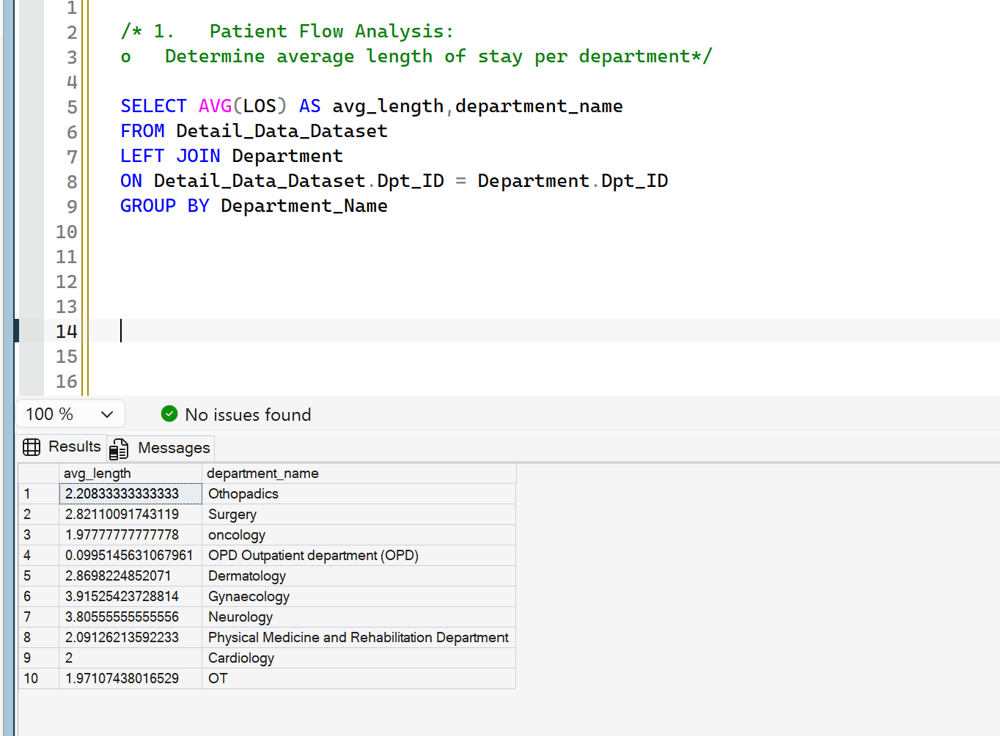
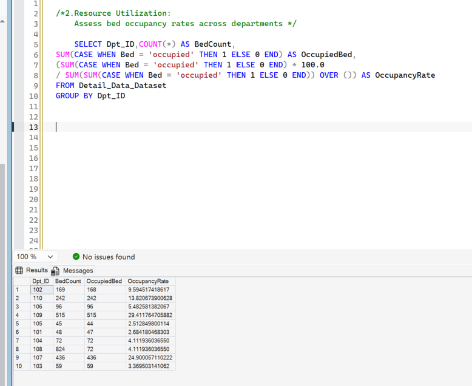
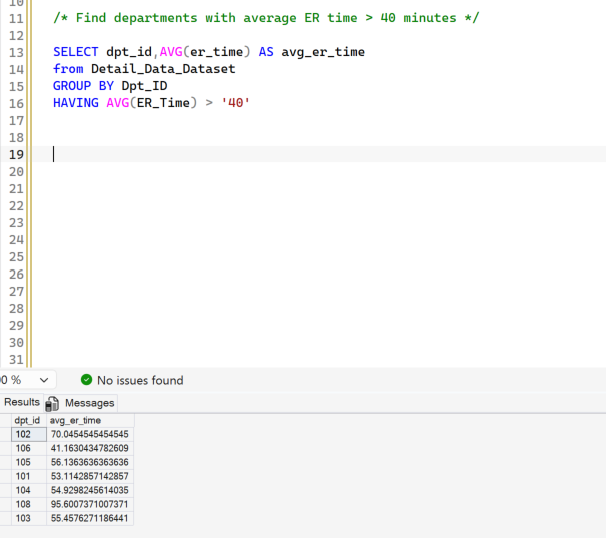

# Healthcare Analytics with SQL

## Project context

SQL analytics portfolio project completed through hands-on training using a
provided hospital resource-management case-study dataset.

## Project status

Verification is in progress. Do not link this repository from a resume until the
corrected SQL scripts have been run in SQL Server Management Studio and the
results below have been checked. The earlier report contains a department-count
discrepancy and an incorrect department-ranking query.

## Project overview

This project uses T-SQL to examine a provided hospital dataset across three
themes: patient flow, resource utilization, and operational efficiency.

## Business questions

- How does average length of stay vary by department?
- When do admissions appear to be highest in the provided dataset?
- How do bed occupancy and staff-to-patient ratios vary?
- Which departments have relatively long emergency-room wait times?
- How do treatment cost and encounter count compare across departments?

## SQL files

Run the scripts in this order after importing the four Excel sheets into `HospitalDB`:

1. `sql/00_data_quality_checks.sql`
2. `sql/01_patient_flow.sql`
3. `sql/02_resource_utilization.sql`
4. `sql/03_operational_efficiency.sql`

The corrected ranking query ranks departments by aggregated treatment cost, not
by department ID. The data-quality script confirms the number of departments in
both the encounter table and lookup table before any public count is stated.

## Reference images from the earlier report

These images document the earlier analysis. They are not substitutes for fresh
screenshots from the corrected SQL scripts.

## Findings verification status

Exact findings are intentionally not published yet because the corrected scripts
still need to be run against the source tables.

- **Patient flow:** run `sql/01_patient_flow.sql`, confirm that every department
  is represented, and check the length-of-stay and status values before recording
  the strongest observation.
- **Resource utilization:** run `sql/02_resource_utilization.sql` and describe the
  occupancy result as the share of encounter records marked occupied. The source
  does not provide verified physical bed capacity, so do not call this a hospital
  bed-occupancy rate.
- **Operational efficiency:** run `sql/03_operational_efficiency.sql` and use its
  aggregated treatment-cost ranking. The earlier report and screenshot disagree
  on the number of departments above the emergency-room wait-time threshold; the
  corrected query output must be used as the source of truth.

After running the scripts, replace this section with three concise findings that
include the verified values and the query file used for each value.

## Repository contents

- `sql/` - corrected T-SQL validation and analysis scripts
- `images/` - reference screenshots from the earlier project write-up

Files to add after verification:

- `project-report.pdf` - export and add only after correcting and rechecking the report
- `data/` - add the case-study data only if redistribution is permitted

## Data and limitations

This case-study analysis is for portfolio presentation. Results must not be used
for patient-care or hospital-management decisions. The `ID` field
appears to identify encounters rather than a stable patient across visits, so
repeat-patient analysis requires a better patient identifier.
